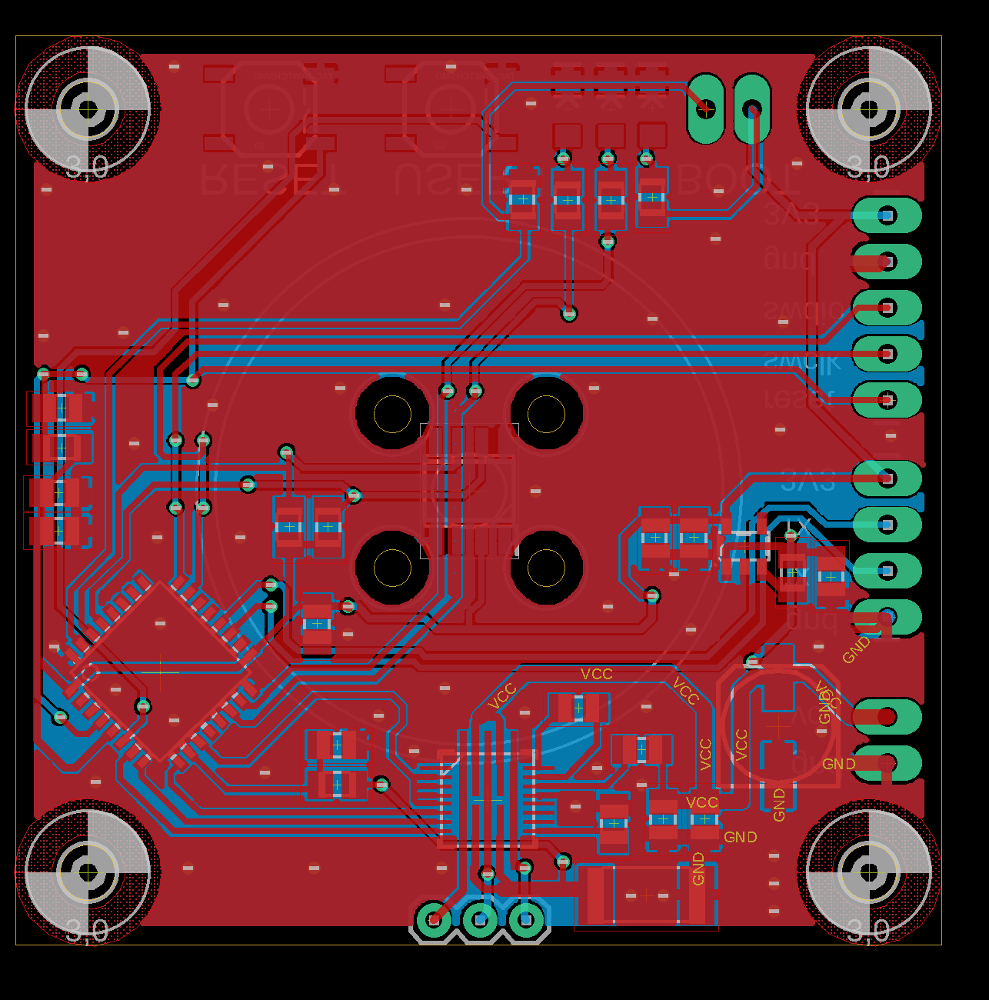
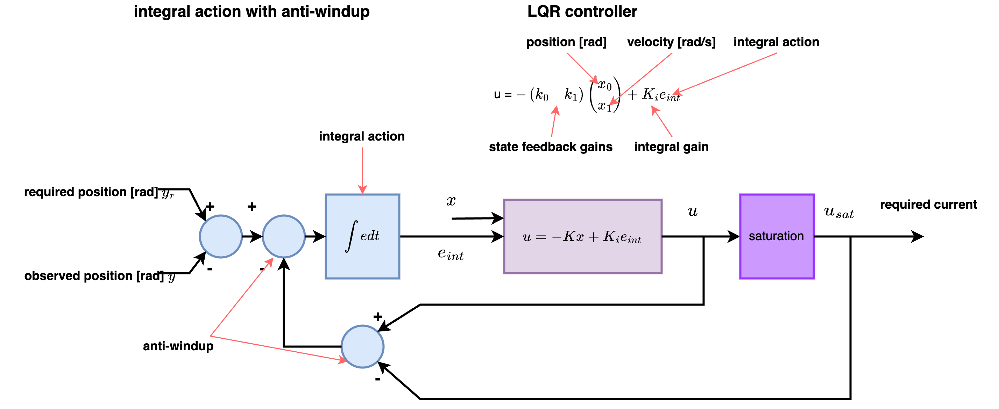
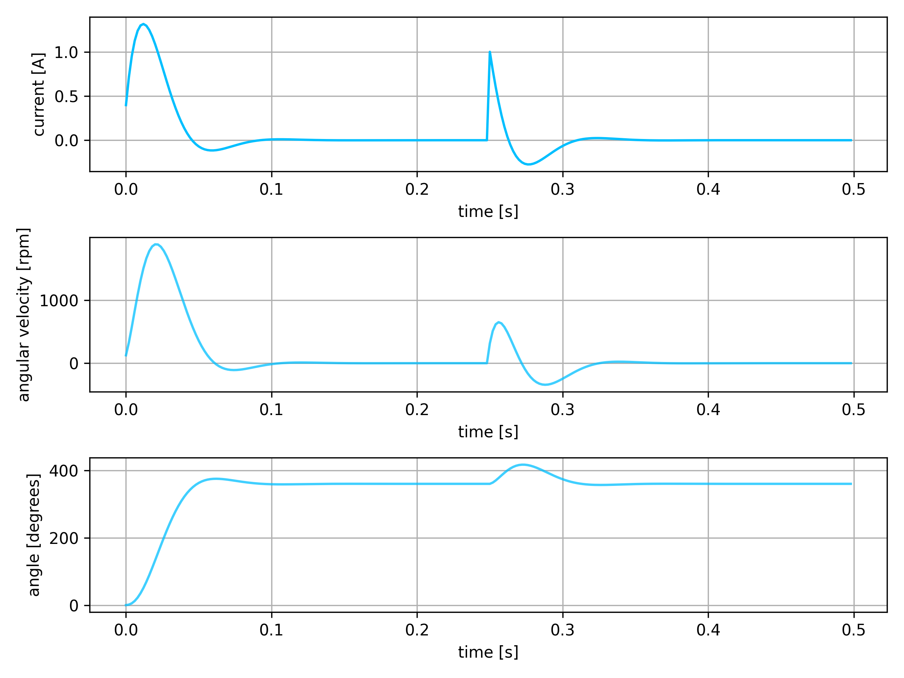

# stm32 FOC brushless motor controller


# repository

## utils : [utils](utils)
- testing utils and simulations
- transformation tests : transform_test.py
- PI current synthetis : pi_torque.ipynb
- LQR synthetis : lqr_design.ipynb
- requires [LibsControll](https://github.com/michalnand/libs_control)


## hardware : [hardware](hardware)
- eagle files
- 3D priting parts (jig for magnet centering)
- IMPORTANT - in schematic is wrong MP6540HA, correct is MP6540H (pwm only driver with enable)

- MCU   : stm32f051, arm cortex m0, 48MHz
- 3phase driver : MP6540H (DONT MP6540HA), 5A, 50V
- encoder : AS5600, 12bit, i2c





## firmware : [firmware](firmware)
- main code for stm32f051
- core is in **user** folder
- see motor.cpp and motor_control.cpp to understand all details


# FOC block diagrams


# transformation tests

basic tranformations tests :
- clarke - park - pwm scaling
- see [transform_test.py](utils/transform_test.py)


# fast running transformations in fixed point

## key features

- sine and cosine is precomputed, 1024 values arrays
- angle 2pi == 1024 (or 0) into tables
- theta ranges from <0, 1023>
- SINE_TABLE_MAX  represents "one", 1023 in tables
- square root of 3 is also precomputed, as fraction of x/1024 
- all divisions are by power of 2 - to avoid slow division
- this can easily run few kHz on cortex m0 (48MHz ARM)

```c++

#define SQRT3       ((int32_t)1773)      // sqrt(3)     = 1773/1024
#define SQRT3INV    ((int32_t)591)       // 1/sqrt(3)   = 591/1024


void Motor::set_park(int32_t d, int32_t q, uint32_t theta)
{
    //inverse Park transform
    int32_t alpha = (d*cos_tab(theta) - q*sin_tab(theta))/SINE_TABLE_MAX;
    int32_t beta  = (d*sin_tab(theta) + q*cos_tab(theta))/SINE_TABLE_MAX;

    this->set_clarke(alpha, beta);
}

void Motor::set_clarke(int32_t alpha, int32_t beta)
{
    //inverse Clarke transform
    int32_t a = alpha;
    int32_t b = -(alpha/2) + (SQRT3*beta)/(2*1024);
    int32_t c = -(alpha/2) - (SQRT3*beta)/(2*1024);


    this->set_phases(a, b, c); 
}

void Motor::set_phases(int32_t a, int32_t b, int32_t c)
{
    //transform into space-vector modulation, to achieve full voltage range
    int32_t min_val = min3(a, b, c);
    int32_t max_val = max3(a, b, c); 

    int32_t com_val = (min_val + max_val)/2;  

    //normalise into 0..MOTOR_CONTROL_MAX
    int32_t a_pwm = ((a - com_val)*SQRT3INV)/1024 + MOTOR_CONTROL_MAX/2;
    int32_t b_pwm = ((b - com_val)*SQRT3INV)/1024 + MOTOR_CONTROL_MAX/2;
    int32_t c_pwm = ((c - com_val)*SQRT3INV)/1024 + MOTOR_CONTROL_MAX/2;
    
     
    a_pwm = clamp((a_pwm*PWM_PERIOD)/MOTOR_CONTROL_MAX, 0, PWM_PERIOD);
    b_pwm = clamp((b_pwm*PWM_PERIOD)/MOTOR_CONTROL_MAX, 0, PWM_PERIOD);
    c_pwm = clamp((c_pwm*PWM_PERIOD)/MOTOR_CONTROL_MAX, 0, PWM_PERIOD);

    set_pwm(a_pwm, b_pwm, c_pwm);
}
```


# fast running PID in fixed point

- controller is first discretised in constructor 
- dt is sampling period in miliseconds
- kp, ki, kd are common controller constants, multiplied by 16384, to avoid floating point

```c++
k0 = kp + ((ki*dt)/1000) + ((kd*1000)/dt);
k1 = -kp - 2*((kd*1000)/dt);
k2 = ((kd*1000)/dt); 
```

- whole PID is just 3 multiplications and 4 additions
- to avoid integral windup, only clamping output is necessary 

```c++
int32_t PID::step(int32_t error)
{
    this->e2 = this->e1;
    this->e1 = this->e0;
    this->e0 = error;

    int32_t du = (k0*e0 + k1*e1 + k2*e2)/16384;
    u+= du;

    //anti windup
    if (u > antiwindup_max)
    {
        u = antiwindup_max;
    }
    
    if (u < antiwindup_min)
    {
        u = antiwindup_min;
    }

    return u;
}
```


# LQR position controller

see [lqr_design.ipynb](utils/lqr_design.ipynb)

## whole controller structure




## closed loop response + disturbance rejection




## poles

